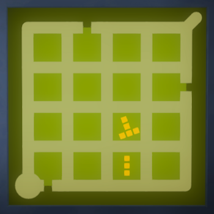
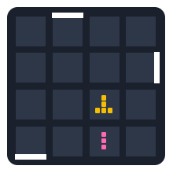
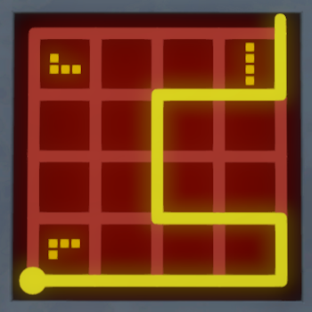
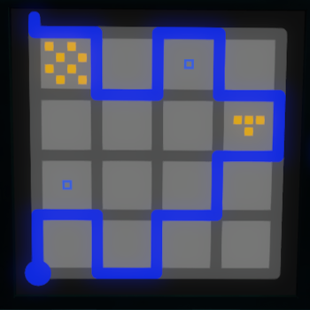
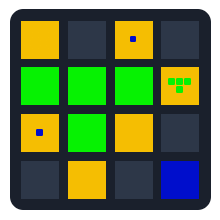

# The Witness Tetris Sandbox
A web-based sandbox for solving [The Witness](http://store.steampowered.com/app/210970/) Tetris puzzles. Place, rotate, and experiment with Tetris pieces on customizable grids.

<p align="center" style="display:flex; align-items:center; gap:8px; justify-content:center;">
  
  <span style="font-size:32px; line-height:1;">→</span>
  
</p>

<p align="center" style="display:flex; align-items:center; gap:8px; justify-content:center;">
  
  <span style="font-size:32px; line-height:1;">→</span>
  
</p>

<p align="center" style="display:flex; align-items:center; gap:8px; justify-content:center;">
  
  <span style="font-size:32px; line-height:1;">→</span>
  
</p>

## Features
- Configurable grid size
- Drag-and-drop piece placement with snapping
- Click to rotate pieces
- Custom piece creation with color and pattern design
- Edition mode: Edit the grid by drawing walls and putting pieces on cells

## Demo

The website is available at [https://witness.gatienh.fr/](https://witness.gatienh.fr/). Here's a quick demo of how to use it:

<p align="center">
  <video width="200px" style="border-radius: 10px;" autoplay loop muted>
    <source src="examples/solution_3_demo.mp4" type="video/mp4">
  </video>
</p>

## Technologies
- React
- TypeScript
- Vite
- react-dnd
- Tailwind CSS

## Quick Start
```bash
npm i
npm run dev
```